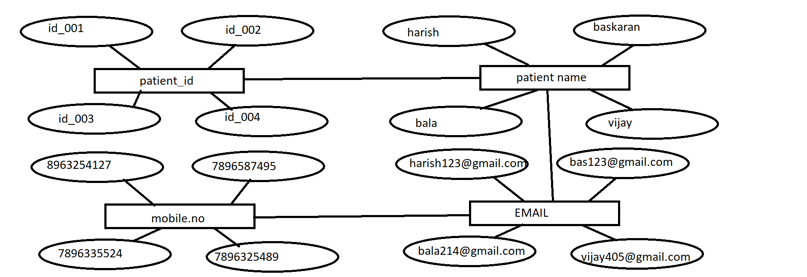
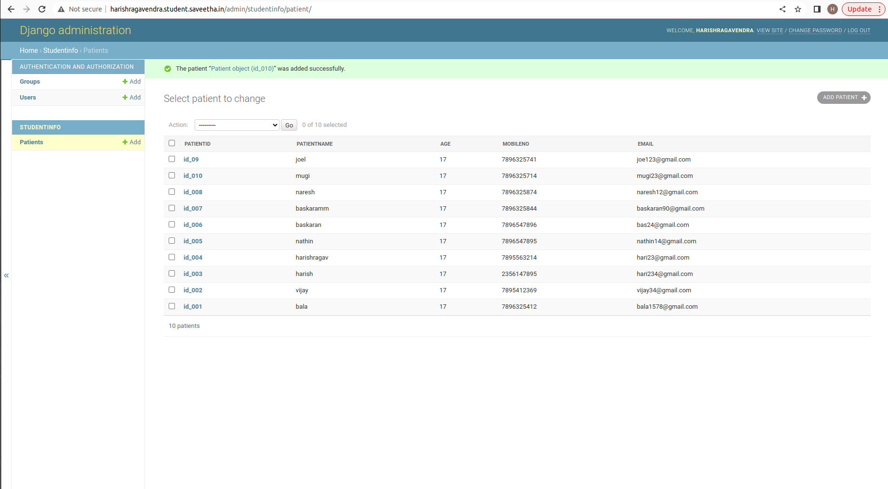
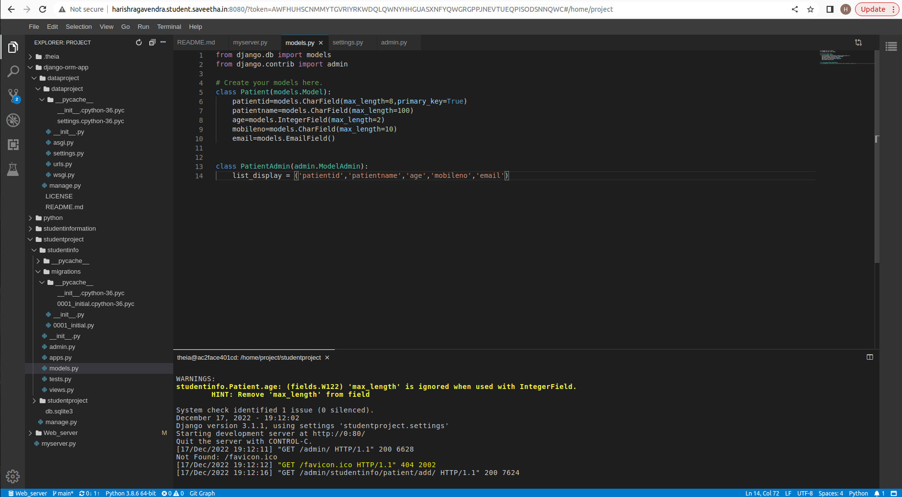

# Django ORM Web Application

## AIM
To develop a Django application to store and retrieve data from a database using Object Relational Mapping(ORM).

## Entity Relationship Diagram



## DESIGN STEPS

### STEP 1:
creating a table using patient details in ORM

### STEP 2:
upload the python code

### STEP 3:

push the code to github

## PROGRAM
```
from django.db import models
from django.contrib import admin

# Create your models here.
class Patient(models.Model):
    patientid=models.CharField(max_length=8,primary_key=True)
    patientname=models.CharField(max_length=100)
    age=models.IntegerField(max_length=2)
    mobileno=models.CharField(max_length=10)
    email=models.EmailField()


class PatientAdmin(admin.ModelAdmin):
    list_display = ('patientid','patientname','age','mobileno','email')
```


## OUTPUT





## RESULT

Thus the experiment was executed successfully..
